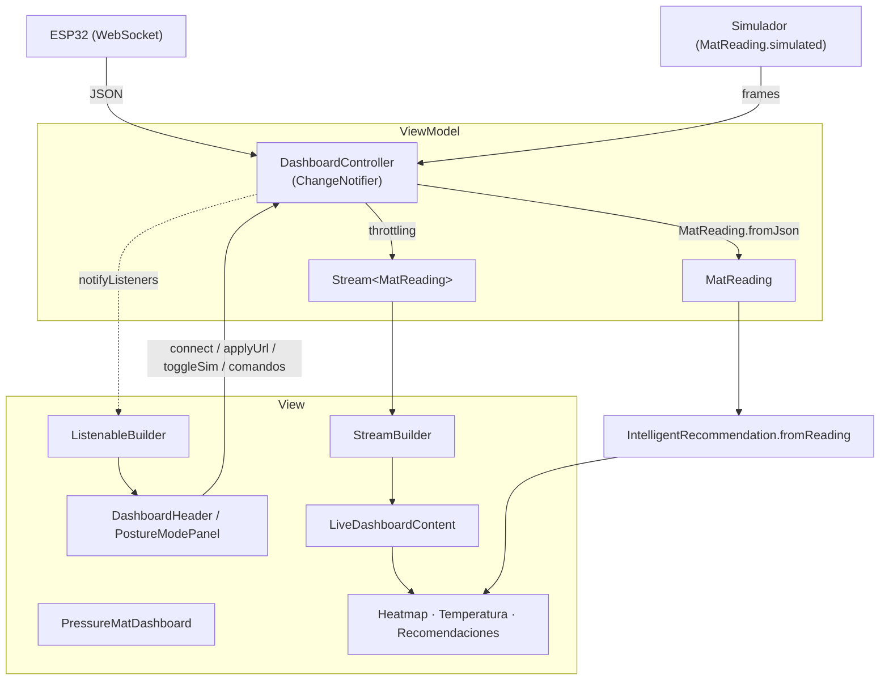

# Arquitectura de Derma Sense

Esta guía explica cómo está organizado el código para que cualquier persona que
se integre al proyecto entienda **dónde vive cada cosa** y **cómo fluyen los
datos** desde el ESP32 hasta la pantalla.

El proyecto sigue una separación por capas estilo **MVVM** (Model · ViewModel ·
View) más una capa `core` de utilidades transversales. La regla de oro es:

> La UI no sabe de WebSockets ni de timers. La lógica no sabe de widgets.

---

## 1. Estructura de carpetas

```text
lib/
├── main.dart                     # Punto de entrada (solo runApp)
├── app.dart                      # MedicalMatApp: tema Material 3 + MaterialApp
│
├── core/                         # Infraestructura transversal (sin lógica de negocio)
│   ├── constants/
│   │   └── app_config.dart       # URLs, geometría del tapete, umbrales clínicos, tiempos, assets
│   ├── theme/
│   │   └── app_colors.dart       # Paleta de colores (AppColors)
│   └── utils/
│       ├── formatters.dart       # formatTemperature, formatTime, mockModeLabel, ...
│       └── visual_mappers.dart   # pressureColor, temperatureColor, riskColor, ...
│
├── models/                       # (Model) Datos + lógica de dominio pura
│   ├── enums.dart                # Estados: conexión, riesgo, postura, tipo de recomendación
│   ├── mat_reading.dart          # MatReading: parseo del JSON + métricas derivadas
│   ├── posture_labels.dart       # Etiquetas NTC y zona anatómica según postura
│   └── intelligent_recommendation.dart  # Motor de reglas clínicas
│
├── viewmodels/                   # (ViewModel) Estado + orquestación
│   └── dashboard_controller.dart # WebSocket, simulación, throttling y estado observable
│
└── views/                        # (View) Pantallas y widgets de presentación
    ├── dashboard_screen.dart     # PressureMatDashboard (escucha al controller)
    └── widgets/
        ├── dashboard_header.dart
        ├── mock_scenario_panel.dart
        ├── posture_mode_panel.dart
        ├── summary_grid.dart
        ├── clinical_layout.dart
        ├── pressure_heatmap_panel.dart
        ├── temperature_section.dart
        ├── smart_recommendations_panel.dart
        └── common/               # Widgets reutilizables
            ├── premium_card.dart
            ├── pills.dart        # InfoPill, ConnectionChip, SourceBadge, RiskBadge
            ├── section_header.dart
            └── indicators.dart   # TemperatureDot
```

---

## 2. Responsabilidad de cada capa

### `core/` — Infraestructura transversal
Constantes, tema y funciones puras que cualquier capa puede usar. No contiene
estado ni lógica de negocio. Si vas a cambiar un umbral clínico, una URL o un
color, es aquí (`app_config.dart` / `app_colors.dart`).

### `models/` — Dominio
El "qué" del problema, sin Flutter de por medio (salvo tipos de color/ícono en
los mapeos):

- **`MatReading`**: una lectura inmutable del tapete. Sabe parsear el JSON del
  ESP32 y exponer métricas derivadas (`maxPressure`, `peakClinicalTemperature`,
  `hotspotIndex`, conteos de alertas, etc.).
- **`IntelligentRecommendation`**: el "cerebro". A partir de una `MatReading` y
  la postura, decide el mensaje, la ilustración y el nivel de riesgo. Toda la
  lógica clínica está en `IntelligentRecommendation.fromReading`, fácil de leer
  y de probar de forma aislada.
- **`enums.dart` / `posture_labels.dart`**: estados y traducción de sensores a
  zonas anatómicas según el modo (sentado/acostado).

### `viewmodels/` — Orquestación y estado
- **`DashboardController` (`ChangeNotifier`)**: el corazón del flujo. Se conecta
  al WebSocket, maneja errores/timeouts/reconexión, parsea mensajes a
  `MatReading`, los publica con *throttling*, genera datos simulados y envía
  comandos al firmware. Expone su estado mediante getters y avisa de los cambios
  con `notifyListeners()`.

### `views/` — Presentación
Widgets "tontos": reciben datos y callbacks, dibujan. No contienen lógica de
negocio. `PressureMatDashboard` es el único punto que conoce al controlador: lo
crea, lo escucha con `ListenableBuilder` + `StreamBuilder` y reparte los datos a
los paneles.

---

## 3. Flujo de datos



**En palabras:**
1. El ESP32 (o el simulador) entrega datos al `DashboardController`.
2. El controlador los convierte en `MatReading` y los publica por un `Stream`
   limitado en frecuencia (*throttling*) para no saturar la UI.
3. La vista escucha dos cosas: el `Stream` de lecturas (`StreamBuilder`) y los
   cambios de estado del controlador (`ListenableBuilder`: conexión, errores,
   modo postura, etc.).
4. Cada panel deriva lo que necesita de la `MatReading`; el panel de
   recomendaciones además invoca `IntelligentRecommendation.fromReading`.
5. Las acciones del usuario (Aplicar URL, Reconectar, Simular, comandos mock)
   viajan de la vista al controlador como simples llamadas a métodos.

---

## 4. Regla de dependencias

Las flechas de importación solo apuntan "hacia abajo":

```text
views  →  viewmodels  →  models  →  core
  └─────────────────────────────────┘  (todas pueden usar core)
```

- `core` no importa nada del proyecto.
- `models` solo importa `core`.
- `viewmodels` importa `models` y `core` (nunca `views`).
- `views` puede importar todo lo anterior.

Respetar esta dirección evita ciclos y mantiene la lógica testeable sin UI.

---

## 5. Convenciones

- **Un archivo por responsabilidad.** Los widgets usados en un solo lugar se
  mantienen privados (`_NombreWidget`) dentro de su archivo; los compartidos
  entre archivos son públicos y viven en `views/widgets/common/`.
- **Imports `package:derma_sense/...`** (absolutos) para que la ubicación de
  cada símbolo sea evidente.
- **Documentación `///`** en todo lo público (clases, métodos, getters). Las
  decisiones no obvias se explican en el cuerpo.
- **Nada de números mágicos en la UI:** los umbrales y medidas viven en
  `app_config.dart`.

---

## 6. Cómo agregar una feature (receta rápida)

1. ¿Es un dato/cálculo nuevo? Añádelo a `MatReading` (getter derivado) o crea un
   modelo en `models/`.
2. ¿Necesita estado o hablar con el ESP32? Exponlo desde `DashboardController`
   (un getter + un método) y llama a `notifyListeners()` al cambiar.
3. ¿Es visual? Crea un widget en `views/widgets/` (o `common/` si es
   reutilizable) que reciba los datos por parámetro.
4. Conéctalo en `dashboard_screen.dart` leyendo del controlador.
5. Verifica con `flutter analyze` y `flutter test`.

---

## 7. Verificación

```bash
flutter analyze   # debe terminar en "No issues found!"
flutter test      # pruebas de widget
```

> Nota: el primer caso de `test/widget_test.dart`
> (`medical mat dashboard smoke test`) busca textos que ya no existen en la UI
> (`Riesgo Verde`, `Temperatura NTC`); falla por desajuste de contenido, no por
> la arquitectura. Es un pendiente previo a esta reestructuración.
